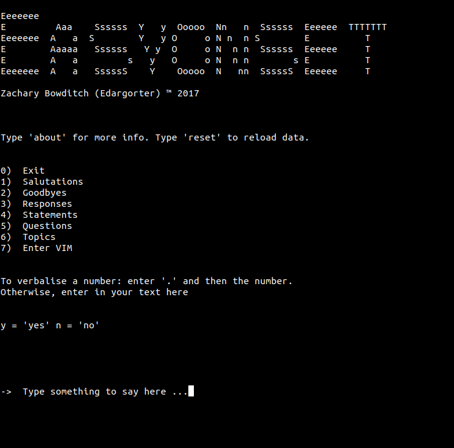

EASYONSET ™

Zachary Bowditch (Edargorter) 2017

0. Navigate to Easyonset folder
1. run install.sh
2. Fix any errors on your part ...
3. Get over the throat infection and get talking.

Usage:

0. Run with: easy

1. -> Type something here to say.
2. <Enter>

... speaks ...

3. Type "." followed by a numeral for verbalisation of number.
	e.g. ". 123" will verbalised the number 123, rather than throw Menu number out-of-range error.

4. Use a terminal editor to write the message. 
5. Choose from / add to topical phrases.

